# Building a Wazuh Home SOC: Detection Engineering and Automated Active Response

*By Izaan Shumaiz*

---

## 1. Introduction

Most "SOC home lab" projects stop at installing a SIEM and pointing it at an endpoint. This one goes further: I deployed Wazuh as the core of a small home SOC, connected a Windows and a Linux endpoint to it, extended its default detection coverage with two original correlation rules mapped to MITRE ATT&CK, built a dashboard for day-to-day monitoring, and configured automated active response so that a qualifying alert doesn't just sit in a log — it gets contained.

Just as importantly, I didn't take any of it on faith. Every rule and every response was tested against activity I generated myself: real SSH brute-force attempts, a Guest account being enabled, files being created and deleted under a monitored path. This writeup walks through the full build, the reasoning behind each decision, and the evidence that each piece actually works.

## 2. Objectives

- Deploy a working Wazuh manager and enroll heterogeneous endpoints (Windows 10 and Ubuntu Linux) as monitored agents.
- Extend endpoint visibility with Sysmon on the Windows agent.
- Validate telemetry end-to-end before building anything on top of it.
- Go beyond Wazuh's default ruleset with original detections mapped to MITRE ATT&CK.
- Build a SOC dashboard for day-to-day monitoring.
- Configure automated active response so detections turn into containment, not just alerts.
- Validate the full detect → respond → recover cycle against self-generated attack activity.

## 3. Lab Architecture

The lab is a small hub-and-spoke SOC: a single Wazuh manager acting as the central log collection, correlation, and alerting point, with two monitored endpoints reporting into it over an isolated network segment.

```
                      ┌──────────────────────────┐
                      │   Wazuh Manager (node01) │
                      │        v4.14.7           │
                      └────────────┬─────────────┘
                                   │  192.168.68.0/24
                 ┌─────────────────┴────────────────────┐
                 │                                      │
     ┌───────────▼───────────┐            ┌─────────────▼───────────┐
     │   IZAAN-Windows       │            │   IZAAN-Linux           │
     │   Windows 10 Pro      │            │   Ubuntu 24.04.5 LTS    │
     │   + Sysmon            │            │   SSH exposed for       │
     │   192.168.68.131      │            │   brute-force testing   │
     │                       │            │   192.168.68.130        │
     └───────────────────────┘            └─────────────────────────┘
```

All three VMs run in Oracle VirtualBox on a Windows host, sharing one isolated network so the "attacker" traffic never leaves the lab.

## 4. Environment

| Component | Details |
|---|---|
| Hypervisor | Oracle VirtualBox, hosted on a Windows PC (32 GB RAM) |
| SIEM / XDR | Wazuh v4.14.7 — single-node manager (`node01`) |
| Network | `192.168.68.0/24`, isolated VirtualBox segment |
| Agent 001 | `IZAAN-Windows` — 192.168.68.131 · Windows 10 Pro, build 10.0.19045.3803 · 2 vCPU / 4 GB RAM · Sysmon installed |
| Agent 002 | `IZAAN-Linux` — 192.168.68.130 · Ubuntu 24.04.5 LTS · SSH exposed for brute-force testing |

## 5. Wazuh Manager Deployment

The first step was standing up the Wazuh manager itself (`node01`, v4.14.7) — the piece everything else in this build depends on. It's the single point that collects logs, runs correlation rules against them, and raises alerts, so getting it stable before enrolling anything else mattered more than it might sound.

## 6. Windows & Linux Agent Enrollment

With the manager up, I enrolled both endpoints as Wazuh agents: `IZAAN-Windows` (Windows 10 Pro) and `IZAAN-Linux` (Ubuntu 24.04.5 LTS). Wazuh's Endpoints view confirmed both as active immediately after enrollment, one of each OS type, under the default group.

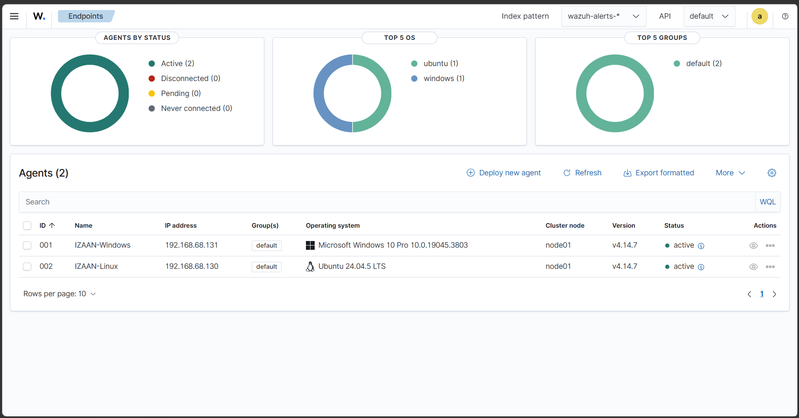
*Two agents enrolled and reporting in: one Windows, one Linux.*

## 7. Sysmon Integration

Native Windows Event Logs only go so far, so I installed and configured Sysmon on `IZAAN-Windows` to capture process creation, network connections, and file-level activity that Windows doesn't log by default. The payoff shows up directly in the agent's dashboard — its MITRE ATT&CK tactic breakdown (Privilege Escalation, Persistence, Lateral Movement, Defense Evasion, Execution) is populated almost entirely from Sysmon-derived events, which native logging alone wouldn't have surfaced.

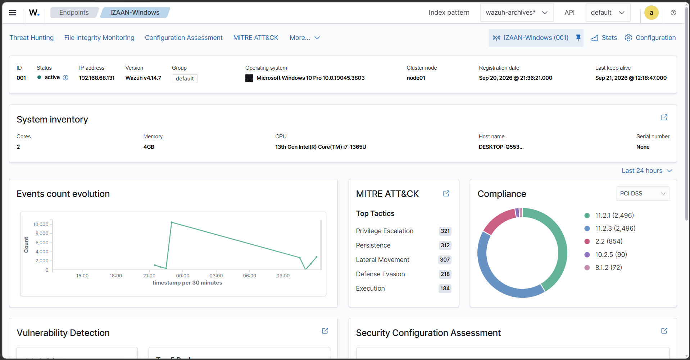
*System inventory, 24-hour event volume, and MITRE ATT&CK tactic counts (Privilege Escalation 321, Persistence 312, Lateral Movement 307, Defense Evasion 218, Execution 184) — almost all Sysmon-sourced.*

## 8. Telemetry Validation

Before writing a single custom rule or dashboard panel, I wanted proof that telemetry was actually flowing correctly from both agents — not just that they showed "active" in the endpoints list. So I generated ordinary activity on both machines and watched it land in Wazuh in near real time: file operations on Windows, login attempts on Linux, standard OS noise on both. Only once that was confirmed did it make sense to start layering detections on top.

## 9. Threat Hunting

With telemetry confirmed, I used Wazuh's built-in Threat Hunting view to get a sense of what the environment actually looked like at scale. Over the review window, the Windows agent alone logged **22,028 total events**, including **49 alerts at level 12 or above**, **9 failed authentications**, and **6 successful authentications** — spread across alert groups spanning Sysmon, Windows security/application logs, the vulnerability detector, and SCA.

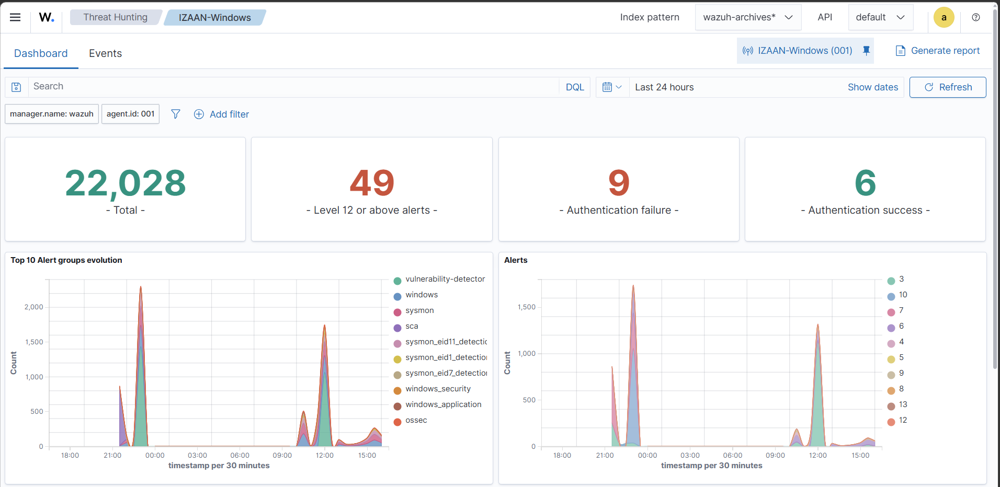
*Total event volume, high-severity alert count, and authentication activity for IZAAN-Windows.*

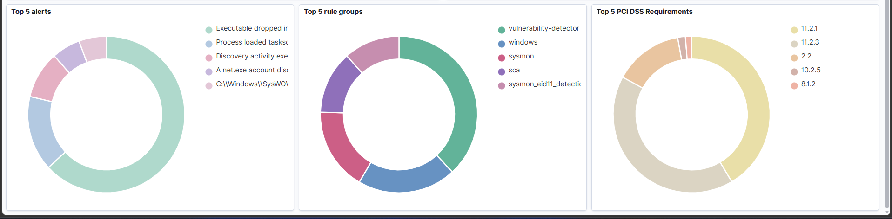
*Top alert types, top rule groups, and top PCI DSS requirements touched by observed activity.*

## 10. Custom SOC Dashboard

Rather than re-running the same searches every time I wanted a status check, I built a dedicated dashboard consolidating the signals I actually cared about day-to-day: failed Windows logons, Linux SSH authentication activity by source, Windows account-change events over time, and a running total of user-account modifications.

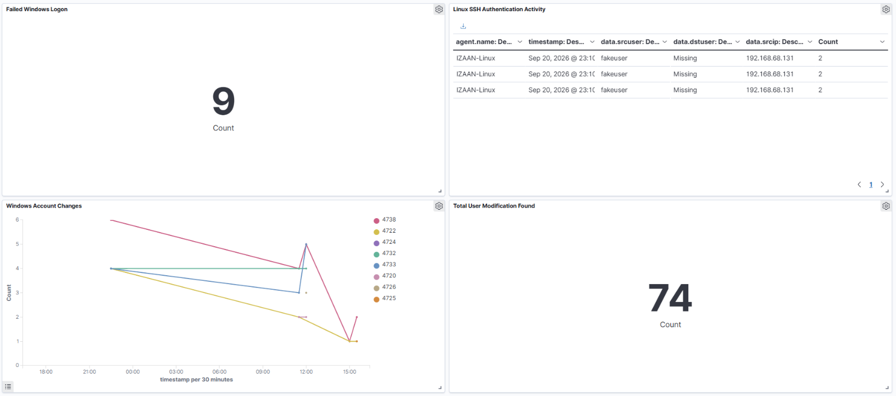
*Failed Windows logons (9), Linux SSH authentication attempts by source, Windows account-change trend, and total user modifications (74).*

## 11. File Integrity Monitoring

I enabled Wazuh's File Integrity Monitoring (syscheck) on a watched directory and validated it the only way that actually proves anything: by creating, modifying, and deleting files myself and confirming each action showed up as the correct event type.

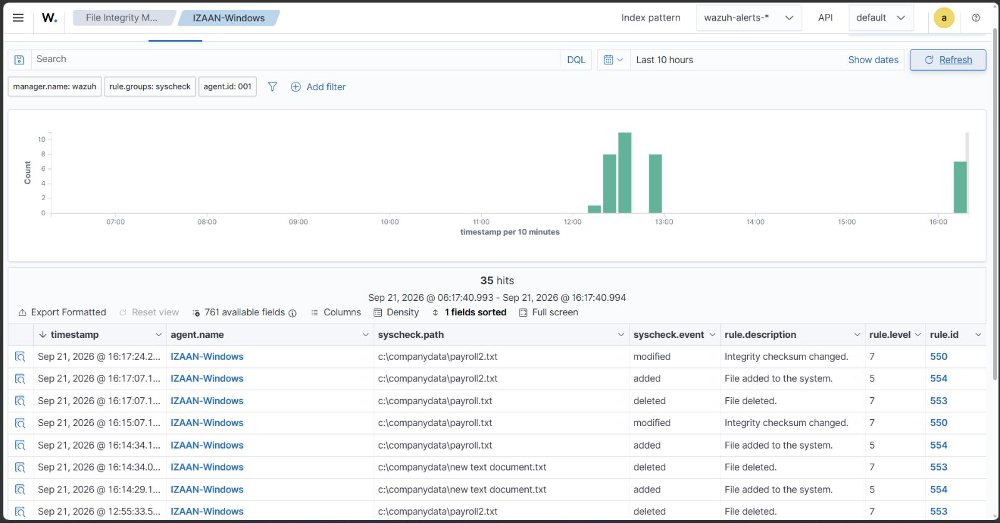
*35 hits over the test window — file additions, modifications, and deletions under a monitored directory, each correctly classified by rule (550 / 553 / 554).*

## 12. Detection Engineering

Wazuh's default ruleset covers a lot, but I wanted rules of my own — written, tuned, and tested by me, not just inherited. I added two to `local_rules.xml`:

### SSH Brute Force
**Rule 100101** (level 10, `frequency="3"` `timeframe="120"`) fires when three or more SSH authentication failures are observed from the same source IP within a 120-second window.

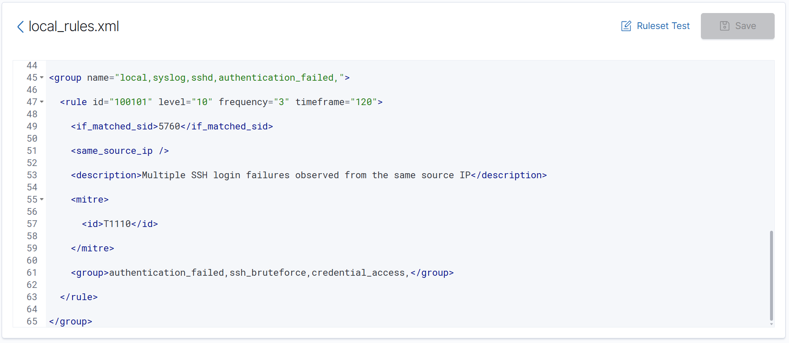
*Rule 100101 — repeated SSH failures from one source, mapped to MITRE T1110.*

### Guest Account Enabled
**Rule 100200** (level 12) fires on Windows Event ID 4722 specifically when the target user is `Guest` — catching the built-in Guest account being re-enabled, a classic low-and-slow persistence move.

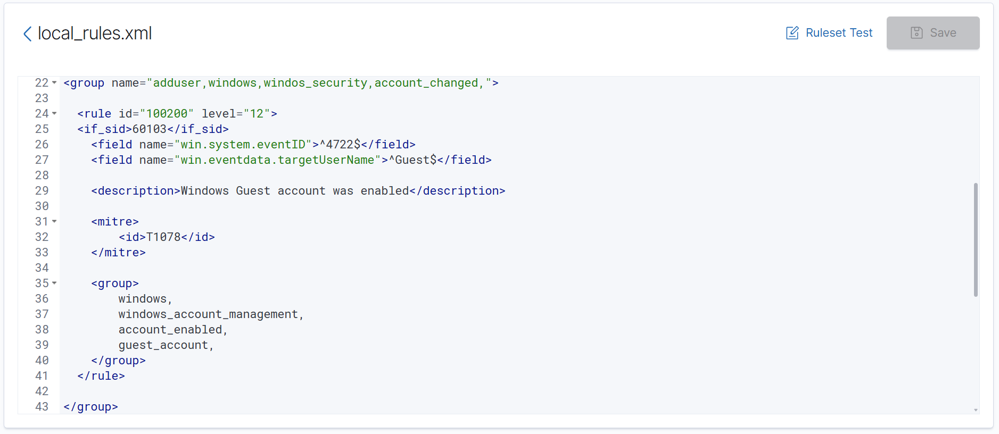
*Rule 100200 — Windows Guest account enabled, mapped to MITRE T1078.*

## 13. MITRE ATT&CK Mapping

| Rule | Technique | Tactic |
|---|---|---|
| 100200 — Guest account enabled | T1078 — Valid Accounts | Persistence / Defense Evasion |
| 100101 — SSH brute force | T1110 — Brute Force | Credential Access |

Beyond these two authored rules, the Sysmon-driven telemetry on the Windows agent is already broken down by ATT&CK tactic in Wazuh's own dashboard (Section 7) — Privilege Escalation, Persistence, Lateral Movement, Defense Evasion, and Execution — giving a rough picture of technique coverage even where I hadn't written a dedicated rule.

## 14. Attack Simulation

Configuration on paper doesn't mean much until something actually tries to trigger it. I ran three separate scenarios by hand:

1. **Repeated failed SSH logins** against `IZAAN-Linux` from the same source IP, to trigger rule 100101.
2. **Enabling the Guest account** on `IZAAN-Windows` (logged on as user "Bob"), to trigger rule 100200.
3. **Creating, modifying, and deleting files** under the monitored directory, to exercise syscheck.

## 15. Alert Investigation

Each simulated action produced an alert, and I drilled into the expanded event details for both custom rules to confirm the context was accurate and usable — not just "an alert fired," but the right fields populated correctly.

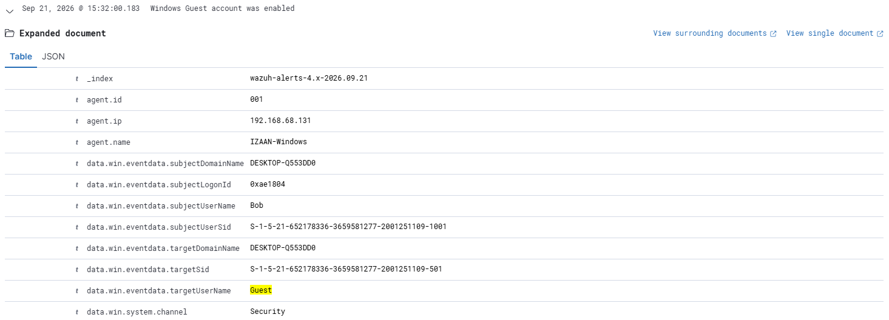
*Rule 100200 firing: user "Bob" (`subjectUserName`) enabled the Guest account (`targetUserName`) on IZAAN-Windows.*

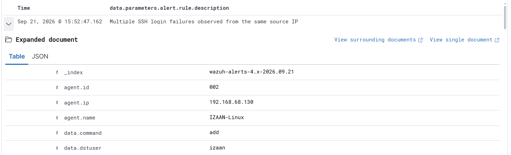
*Rule 100101 firing after repeated failed SSH logins against IZAAN-Linux.*

## 16. Active Response

Detecting the SSH brute-force attempt is only half the job — I wanted the manager to actually do something about it. I configured Wazuh active response so that a qualifying rule 100101 alert automatically triggers a `firewall-drop` response, adding the offending source IP to `iptables` on the Linux agent. No manual intervention required between detection and containment.

## 17. Containment Validation

I didn't just trust that the active response *would* work — I checked. After triggering the block, I:

- Pinged the target from the blocked source → **"connection timed out."**
- Attempted another SSH login from the same source → **"permission denied."**

Both confirmed the IP had actually been dropped at the firewall, not just flagged in a log somewhere.

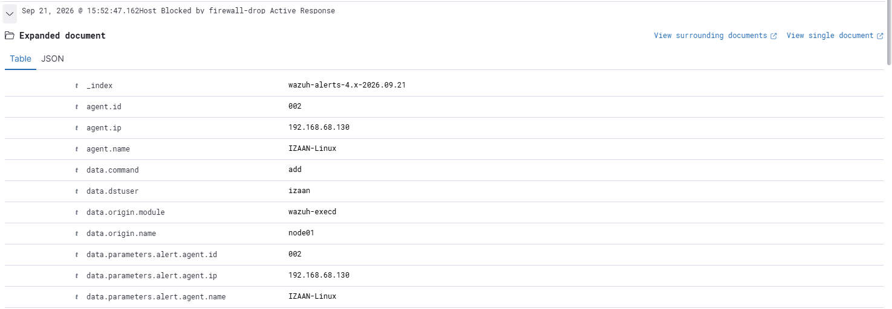
*The offending IP added to iptables via the `firewall-drop` active response after rule 100101 fired.*

## 18. Recovery

Once containment was confirmed, I manually removed the blocked IP from `iptables` on `IZAAN-Linux` to restore legitimate access — closing the loop on the full detect → respond → recover cycle rather than leaving the lab in a permanently locked-down state.

## 19. Troubleshooting

*(A few friction points inevitably come up in a build like this — worth filling in with your own specifics here, for example: agent check-in delays after enrollment, syscheck noise on frequently-written paths that needed scoping down, or rule syntax issues in `local_rules.xml` caught via the Ruleset Test tool before they made it live.)*

## 20. Results

| Scenario | Trigger | Expected Detection | Observed Result |
|---|---|---|---|
| SSH brute force | Repeated failed SSH logins from one source IP | Rule 100101 fires (T1110) | Alert generated; active response blocked the source IP automatically |
| Containment check | Ping + login attempt against the blocked IP | Traffic dropped by firewall-drop | Ping timed out; login returned "permission denied" |
| Recovery | Manual removal of the IP from iptables | Access restored | Connectivity and login access returned to normal |
| Guest account enabled | Guest account enabled on IZAAN-Windows | Rule 100200 fires (T1078) | Alert generated with full event context (source user, target account) |
| File tampering | Files created, modified, and deleted in a monitored path | Syscheck FIM rules fire per event type | All three event types (added / modified / deleted) correctly captured |
| Account-change volume | Windows user/group modification events over time | Tracked on the custom dashboard | 74 total user modifications captured and charted |

## 21. Lessons Learned

*(Worth reflecting here on what you'd genuinely take into your next build — e.g., how much validating telemetry first (Section 8) saved later debugging, or what you'd tune differently about rule frequency/timeframe thresholds now that you've seen them fire against real traffic.)*

## 22. Future Improvements

- Broaden attack simulation with a structured framework such as **Atomic Red Team**, to test coverage against a wider set of ATT&CK techniques than the two rules authored here.
- Add a SOAR layer (**TheHive** or **Shuffle**) to move from active-response scripting toward full case management and orchestration.
- Extend network-level visibility with an IDS such as **Suricata** or **Zeek** alongside the existing host-based telemetry.
- Publish `local_rules.xml` alongside this writeup so the detection logic itself is reviewable, not just described.

---

*Lab build: 20–21 September 2026 · Wazuh v4.14.7 · VirtualBox*
